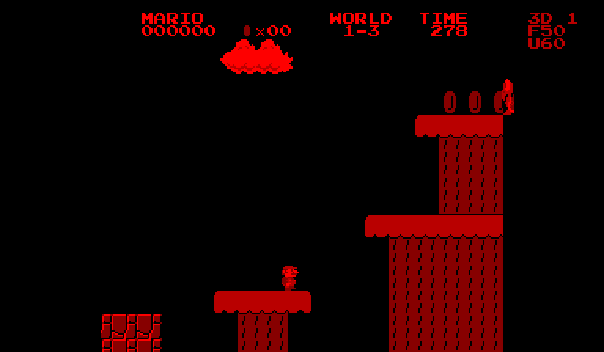

# SMB1 Stereo — Super Mario Bros. for Virtual Boy

An unofficial native Virtual Boy port of Super Mario Bros., with layered stereoscopic graphics, VSU audio and the original level layouts.

## The port

- Native V810 gameplay adapted from SMB Vanilla.
- Original eight worlds and 32 stage layouts; all stages load/render tested.
- Adjustable stereo depth (0–3): background scenery, gameplay plane and foreground HUD.
- Native VSU music and effects adaptation.
- V3 timer-driven pacing targets 60 game updates per second independently of rendering.
- 256 KiB cartridge, with Windows Mednafen launchers in the original local game package.

This is a first playable port. V3 physical hardware behavior still needs confirmation. Campaign-wide tests establish loading/rendering, not complete playthroughs.

## Showcase

Open `index.html` or visit the repository's GitHub Pages site. The site includes nine screenshots from different locations across six worlds, paired stereo views, controls, development notes and a complete World 1-1 gameplay demonstration. The 45-second demo has zero deaths and includes native audio, the underground shortcut, flagpole, castle tally and transition to World 1-2. It is a tool-assisted controller replay, not a speedrun submission.

Gallery levels were staged with the development harness; see [gallery provenance](gallery-report.json). The continuous first-level demo uses no RAM writes, save-state loads or splices; see [capture evidence](capture-report.json) and [input sequence](route.json).

[Full documentation](DOCUMENTATION.md) · [Credits](CREDITS.md) · [Gameplay video](media/world-1-1.mp4) · [Stereo video](media/world-1-1-stereo.mp4)

## Publishing

This is a plain static site. GitHub Pages can publish from `main / (root)` using **Settings → Pages → Deploy from a branch**. No build step is needed. See [GitHub's documentation](https://docs.github.com/en/pages/getting-started-with-github-pages/configuring-a-publishing-source-for-your-github-pages-site).

Super Mario Bros. © Nintendo. Unofficial and unaffiliated. This repository contains footage and documentation, not the ROM, extracted game assets or emulator/toolchain binaries.
