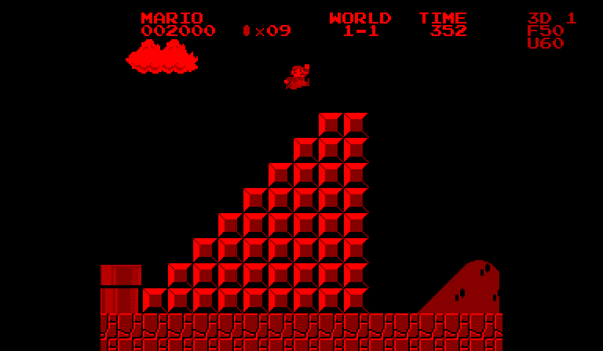

# SMB1 Stereo — World 1-1 showcase

A complete, continuous, tool-assisted playthrough of the supplied **SMB1 Stereo V3 Virtual Boy conversion**, recorded September 19, 2026.

- **45.295 seconds**, from boot through the World 1-2 screen.
- **Zero deaths**; three lives remain. Final score: **19,650**; nine coins.
- Single-eye and side-by-side stereo MP4s, both with cartridge audio.
- Ten screenshots, plus native-resolution stereo versions.
- Responsive static website with video view switching and chapter navigation.

Watch [single-eye video](media/world-1-1.mp4) or [stereo video](media/world-1-1-stereo.mp4). Open `index.html` for the showcase, or serve this folder with any static web server.

See [full documentation](DOCUMENTATION.md), [capture evidence](capture-report.json), [controller sequence](route.json), and [credits](CREDITS.md).

## GitHub Pages

Upload this folder's contents to a new repository named `smb1-vb-showcase`. In **Settings → Pages**, choose **Deploy from a branch**, then **main / (root)** and save. No build step is required. The `.nojekyll` file enables plain static publishing. The project site will be under the repository owner's `github.io` domain at `/smb1-vb-showcase/`.

Reference: [GitHub's publishing-source documentation](https://docs.github.com/en/pages/getting-started-with-github-pages/configuring-a-publishing-source-for-your-github-pages-site).

## Scope

The route uses the underground pipe shortcut. It clears World 1-1; it does not visit every overworld tile or attempt an optimal leaderboard time. Recorded footage uses the unmodified cartridge with ordinary timed controller inputs. No save-state loads, RAM writes, cheats, gameplay patches or video splices are used in the final replay.

This repository contains presentation material, not a game ROM, extracted game assets, or emulator/toolchain binaries. Super Mario Bros. belongs to Nintendo. This is an unofficial personal conversion and showcase.
